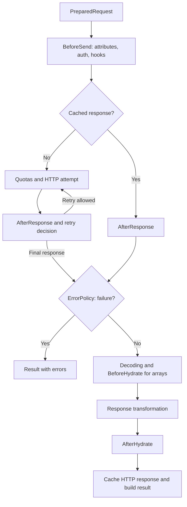

<!-- languages --> <a href="pipeline.md">English</a> · <a href="../../ru/development/pipeline.md">Русский</a> <!-- /languages -->
# Core pipeline 

[Pipeline](../../../src/Pipeline/Pipeline.php) coordinates one request execution: it
creates context, selects the processing branch, and returns `ExecutionResult`.
Pagination selection, batch/pool, and continuation waiting live one level above;
their relationships are described in [execution flows](execution.md).

## Context and execution start 

ClientExecutor creates a local ExecutionEnvelope. `Pipeline::createContext()` uses
PipelineContextFactory to unwrap the request and its option snapshot. ClientExecutor
attaches the dispatcher and starts the scope; `Pipeline::run()` receives that opened
context, creates ExecutionBudget, checks deadlines/response modes, and starts business stages.

PipelineContext carries request/config/options, role/parent/trace/scope/executor,
budget, prepared request/destination, response/lastResponse/dto, failure classification,
and cache/hydration state. Context belongs to one invocation. Reused services must not
store a current context. The executor forwards the child's last response to its parent.

## Validation and branch selection 

`runStages()` defines the order before HTTP sending:

1. [PipelineValidator](../../../src/Pipeline/Flow/PipelineValidator.php) validates the request.
   Then [RequestContractValidator](../../../src/Pipeline/Flow/RequestContractValidator.php)
   checks declarative field constraints. Errors stop execution before preparation.
2. [PipelineCompositeHandler](../../../src/Pipeline/Flow/PipelineCompositeHandler.php) delegates
   composite/depends-on to `CompositeFlow`. A returned result ends the current branch.
   After successful preparation, DependsOn returns control to the same pipeline;
   child requests enter separately.
3. [RequestPreparationStep](../../../src/Pipeline/Flow/RequestPreparationStep.php) builds
   `PreparedRequest` through `PreparedRequestFactory` and `Serializer`.
4. [RequestFlowRunner](../../../src/Pipeline/Flow/RequestFlowRunner.php) executes the prepared
   request and processes the response.

[Request serialization](../reference/serialization/README.md). DependsOn resumes the same context without repeated validation.

## From prepared request to result 

This diagram shows the ordinary branch after preparation. Individual stage errors can
also end it through the exception boundary described below.

`RequestFlowRunner` and its helpers define the exact order:

| Step | Responsibility |
| --- | --- |
| Transport checks and cache preparation | Check destination support; prepare CacheManager state |
| `PipelineStage::BeforeSend` | Let attribute handlers modify PreparedRequest |
| Auth | AuthHandler applies the strategy, accounting for the request destination |
| `Hook::BeforeSend` | Run hooks on the prepared request after auth |
| Destination and file checks | Validate the modified request before cache lookup and transport sending |
| Obtain a response | Read the cache or invoke RetrySender |
| ErrorPolicy | Classify the final response; on failure, build a result without standard hydration |
| Decoding and hydration | ResponseHydrator selects the format; HookRunner runs BeforeHydrate for arrays; then the result value is built |
| After hydration | Attribute handlers for objects, then AfterHydrate hooks |
| Completion | Extract metadata, cache the HTTP response, deliver a download if needed, and build ExecutionResult |

### Cache and retries 

On a cache hit, `RequestFlowRunner` writes the response to `response` and `lastResponse`
and invokes `AfterResponse`. Shared ErrorPolicy and response processing then apply;
the client's hydrator creates a new DTO. The HTTP cache stores responses, not DTOs.

[RetrySender](../../../src/Pipeline/Transport/RetrySender.php) coordinates attempts:
it checks the budget, applies rate limiting, sends the request, and invokes
`AfterResponse` after receiving a response. It then decides on auth recovery and retry.
`BeforeSend` is outside this loop; `AfterResponse` may run multiple times. Rules for
retries, body replay, delays, and quotas belong to [retry](../reference/execution/retry.md),
[rate limiting](../reference/execution/rate-limit.md), and [caching](../reference/execution/cache.md).

### Response transformation 

[ResponseHydrator](../../../src/Pipeline/Hydration/ResponseHydrator.php) selects raw,
download, a response handler, or standard decoding. For array data, `HookRunner`
invokes `BeforeHydrate`. ResponseHydrator then applies the selected handler or standard
unwrap, pagination rules, and DTO hydration.

A non-null response handler result becomes the response value and bypasses standard
unwrap and hydration. Returning null delegates to the standard path. Raw and download
have separate branches; a successful response without a DTO can also contain an
array, scalar, or null. Contracts: [extensions](../reference/extensions/extensions.md#section-7),
[response modes](../reference/execution/transport.md), and
[success without a DTO](../reference/results/handles.md#section-3).

## Connecting extensions 

During standard client construction, `ExtensionRegistry` registers extensions in the
associated cast, hook, and attribute-handler registries. Pipeline components receive
the same registries. A response handler is selected through the registry when processing
the response; its lifecycle is defined in the [public extension contract](../reference/extensions/extensions.md#section-5).

[HookRunner](../../../src/Pipeline/Hooks/HookRunner.php) executes four hook types. Group
order and priorities belong to the [hook contract](../reference/extensions/hooks.md#section-5).
`BeforeHydrate` has a separate invocation path with array data. `AfterHydrate` also
runs for results without a DTO object; attribute processing at this stage requires
an object in `context.dto`.

[StageProcessor](../../../src/Pipeline/Attributes/StageProcessor.php) delegates to
`AttributeRegistry::processStage()`. The current pipeline has three invocation points:
`Started` on the request, `BeforeSend` on the request, and `AfterHydrate` on the result
object. Recording a stage in audit does not itself invoke attribute handlers. Data
and traversal order are described in [attribute internals](attributes.md).

Casts run inside the serializer and hydrator during value transformation. Internal
`HydrationScope` preserves rules for nested DTOs; the public contract is in
[hydration context](../reference/dto/scope.md).

## Errors and early completion 

`ErrorPolicy` classifies ordinary unsuccessful responses; `ResultFactory` builds their
errors. [ExecutionResultBuilder](../../../src/Pipeline/Flow/ExecutionResultBuilder.php)
handles stage exceptions: it always builds a result; finalization and the throw/return
decision happen after assembly at the execution owner's boundary.

`runStages()` catches `EarlyReturnException` from `RequestFlowRunner` separately:
the builder creates an early-completion result and remaining steps do not run. This
boundary is after preparation; arbitrary early exits elsewhere in the pipeline must
not be treated as equivalent.

`ExecutionBudget` is checked between stages and attempts. Deadline expiry after a
custom handler returns can also end the request. With external rules, the result
retains both DTO and source paths; automatic logs use separate safe context. See
[errors](error-handling.md), [DTO diagnostics](../reference/dto/diagnostics.md), and
[deadlines](../reference/execution/deadlines.md).

## Finalization and result delivery 

ExecutionScope has Created → Running → Finalized states and owns trace, clock, and audit.
ClientExecutor owns request scopes; Paginator owns lazy traversal scopes; collecting pagination uses ClientExecutor;
ContinuationService owns await scopes. Pipeline and intermediate builders cannot finish
or publicly throw a result. Scope start is separate from the business Started stage.

ClientExecutor attaches missing metadata, preserves primary FAILED on secondary meta
failure, localizes, checks the final budget for non-FAILED, then finishes once.
Canonical results return directly, without capture or result-carrying exceptions.
Public ResultExceptionSelector and pool callbacks run beyond normalization catches.
ExecutionDispatch marks a foreign executor contract violation so stages/auth/retry
cannot reclassify it; the public owner propagates its original cause.

AuditLogger isolates context construction, translation, and the sink. RetrySender owns
all waits and HTTP admission: delay/backoff/cooldown → quota → cooldown recheck →
effective timeouts → transport. RetryDelayPolicyInterface performs computation only.
CooldownRegistry belongs to the client; additional wait accounting belongs to execution.
Actual HTTP attempts are recorded only at transport entry. The received 429 is observed
before AfterResponse and post-response budget checks. Shared trace alone adds no deadline.
The private admitAttempt method owns admission order; sendAttempt owns the transport
exception boundary; acceptResponse records both ordinary and recording-failure responses.
Retry and cooldown receive one parsed delay anchored to the same response timestamp;
the coordinator does not parse HTTP headers or read a second wall-clock value.

## Where to verify changes 

| Area | Scenarios |
| --- | --- |
| Validation and branch order | [PipelineValidationOrderTest](../../../tests/Unit/Pipeline/PipelineValidationOrderTest.php), [ClientExecutionEntryTest](../../../tests/Unit/Pipeline/ClientExecutionEntryTest.php) |
| Hooks and cached responses | [PipelineIntegrationTest](../../../tests/Unit/Pipeline/PipelineIntegrationTest.php), [BeforeHydrateHookDataTest](../../../tests/Unit/Pipeline/BeforeHydrateHookDataTest.php) |
| Early exit and exceptions | [PipelineEarlyReturnStagesTest](../../../tests/Unit/Pipeline/PipelineEarlyReturnStagesTest.php), [PipelineThrowOnErrorsTest](../../../tests/Unit/Pipeline/PipelineThrowOnErrorsTest.php) |
| Response format and extensions | [SuccessfulResponseContractTest](../../../tests/Unit/Pipeline/SuccessfulResponseContractTest.php), [ExtensionResponseHandlerTest](../../../tests/Unit/Extensions/ExtensionResponseHandlerTest.php) |

Collecting pagination initializes ExecutionBudget before the execution fork; pages share
that parent budget. Pipeline.run only initializes a missing budget for direct internal use.
Final deadline checks preserve partial pagination data and nested results.
