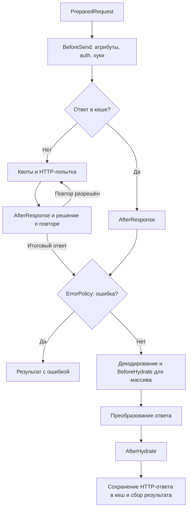

<!-- languages --> <a href="../../en/development/pipeline.md">English</a> · <a href="pipeline.md">Русский</a> <!-- /languages -->
# Pipeline ядра 

[Pipeline](../../../src/Pipeline/Pipeline.php) организует отдельное выполнение запроса:
создаёт контекст, выбирает ветку обработки и возвращает `ExecutionResult`.
Выбор пагинации, batch/pool и ожидание continuation находятся уровнем выше;
их связи описаны в [потоках выполнения](execution.md).

## Контекст и начало исполнения 

ClientExecutor создаёт локальный ExecutionEnvelope. `Pipeline::createContext()` через
PipelineContextFactory извлекает исходный запрос и снимок настроек. ClientExecutor
добавляет dispatcher и запускает область; `Pipeline::run()` получает открытый контекст,
создаёт ExecutionBudget, проверяет deadline/режим ответа и запускает бизнес-стадии.

PipelineContext хранит request/config/options, role/parent/trace/scope/executor,
budget, подготовленный запрос/destination, response/lastResponse/dto, классификацию
ошибки и состояние cache/hydration. Контекст принадлежит одному вызову. Переиспользуемые
сервисы не хранят текущий контекст. Исполнитель передаёт последний ответ ребёнка родителю.

## Валидация и выбор ветки 

`runStages()` задаёт порядок до HTTP-отправки:

1. [PipelineValidator](../../../src/Pipeline/Flow/PipelineValidator.php) проверяет запрос.
   Затем [RequestContractValidator](../../../src/Pipeline/Flow/RequestContractValidator.php)
   проверяет декларативные ограничения полей. Ошибка завершает выполнение до подготовки.
2. [PipelineCompositeHandler](../../../src/Pipeline/Flow/PipelineCompositeHandler.php)
   передаёт composite/depends-on в `CompositeFlow`. Возвращённый результат завершает
   текущую ветку. После успешной подготовки DependsOn возвращает управление
   в тот же pipeline; дочерние запросы входят отдельно.
3. [RequestPreparationStep](../../../src/Pipeline/Flow/RequestPreparationStep.php) через
   `PreparedRequestFactory` и `Serializer` собирает `PreparedRequest`.
4. [RequestFlowRunner](../../../src/Pipeline/Flow/RequestFlowRunner.php) выполняет
   подготовленный запрос и обрабатывает ответ.

[Сериализация запроса](../reference/serialization/README.md). DependsOn продолжает тот же контекст без повторной валидации.

## От подготовленного запроса до результата 

Схема показывает обычную ветку после подготовки. Ошибки отдельных стадий также
могут завершить её через границу исключений, описанную ниже.

Точный порядок задаётся `RequestFlowRunner` и его помощниками:

| Шаг | Ответственность |
| --- | --- |
| Проверка транспорта и подготовка кеша | Проверить поддержку назначения; подготовить состояние CacheManager |
| `PipelineStage::BeforeSend` | Дать обработчикам атрибутов изменить PreparedRequest |
| Авторизация | AuthHandler применяет стратегию с учётом назначения запроса |
| `Hook::BeforeSend` | Выполнить хуки над подготовленным запросом после авторизации |
| Проверки назначения и файлов | Проверить изменённый запрос до кеша и транспортной отправки |
| Получение ответа | Прочитать кеш либо вызвать RetrySender |
| ErrorPolicy | Классифицировать итоговый ответ; при ошибке собрать результат без обычной гидратации |
| Декодирование и гидратация | ResponseHydrator выбирает формат, HookRunner выполняет BeforeHydrate для массива, затем строится значение результата |
| После гидратации | Обработчики атрибутов для объекта, затем хуки AfterHydrate |
| Завершение | Извлечь метаданные, сохранить HTTP-ответ в кеш, доставить download при необходимости, собрать ExecutionResult |

### Кеш и повторные попытки 

При cache hit `RequestFlowRunner` записывает ответ в `response` и `lastResponse`
и вызывает `AfterResponse`. Далее действуют общие ErrorPolicy и обработка ответа;
DTO заново создаётся гидратором клиента. В HTTP-кеше хранится ответ, а не DTO.

[RetrySender](../../../src/Pipeline/Transport/RetrySender.php) управляет попытками:
проверяет бюджет, применяет rate-limit, отправляет запрос и вызывает `AfterResponse`
после полученного ответа. Затем решает вопрос восстановления авторизации и retry.
`BeforeSend` находится снаружи этого цикла; `AfterResponse` может выполниться
несколько раз. Правила повтора, восстановления тела, задержек и квот принадлежат
[retry](../reference/execution/retry.md),
[rate-limit](../reference/execution/rate-limit.md) и
[кешу](../reference/execution/cache.md).

### Преобразование ответа 

[ResponseHydrator](../../../src/Pipeline/Hydration/ResponseHydrator.php) выбирает raw,
download, response handler или стандартное декодирование. Для массива данных
`HookRunner` вызывает `BeforeHydrate`. Затем ResponseHydrator применяет выбранный
обработчик либо штатные unwrap, правила пагинации и гидрацию DTO.

Ненулевой результат response handler становится значением ответа и обходит штатные
unwrap и гидрацию. Возврат null передаёт обработку стандартному пути.
Raw и download имеют отдельные ветки; без DTO успешный ответ также может содержать
массив, scalar или null. Контракты — в
[расширениях](../reference/extensions/extensions.md#section-7),
[режимах ответа](../reference/execution/transport.md) и
[успешном ответе без DTO](../reference/results/handles.md#section-3).

## Подключение расширений 

При штатной сборке клиента `ExtensionRegistry` регистрирует расширения в связанных реестрах
кастов, хуков и обработчиков атрибутов. Эти же реестры получают компоненты пайплайна.
Response handler выбирается через реестр при обработке ответа; его жизненный цикл
описан в [публичном контракте расширений](../reference/extensions/extensions.md#section-5).

[HookRunner](../../../src/Pipeline/Hooks/HookRunner.php) исполняет четыре вида хуков.
Порядок групп и приоритетов принадлежит [контракту хуков](../reference/extensions/hooks.md#section-5).
`BeforeHydrate` получает отдельный путь вызова с массивом данных.
`AfterHydrate` вызывается и для результата без объекта DTO; обработка атрибутов
этой стадии требует объекта в `context.dto`.

[StageProcessor](../../../src/Pipeline/Attributes/StageProcessor.php) передаёт управление
в `AttributeRegistry::processStage()`. В текущем пайплайне это три точки:
`Started` на запросе, `BeforeSend` на запросе и `AfterHydrate` на объекте результата.
Запись стадии в audit сама по себе не вызывает обработчики атрибутов.
Данные и порядок обхода описаны в [устройстве атрибутов](attributes.md).

Casts применяются внутри сериализатора и гидратора при преобразовании значений.
Для вложенных DTO правила сохраняет внутренний `HydrationScope`; публичный
контракт находится в [контексте гидратации](../reference/dto/scope.md).

## Ошибки и раннее завершение 

Обычный неуспешный ответ классифицирует `ErrorPolicy`, а `ResultFactory` собирает
его ошибки. Исключения стадий обрабатывает
[ExecutionResultBuilder](../../../src/Pipeline/Flow/ExecutionResultBuilder.php):
builder всегда строит результат; финализация и выбор throw/return выполняются
после сборки, на границе владельца запуска.

`EarlyReturnException` из `RequestFlowRunner` имеет отдельный перехват в `runStages()`:
builder создаёт результат досрочного завершения, оставшиеся шаги не выполняются.
Эта граница находится после подготовки; произвольный ранний выход из любой части
пайплайна не следует считать эквивалентным этому механизму.

`ExecutionBudget` проверяется между стадиями и попытками. После возврата управления
из пользовательского обработчика превышение срока также может завершить запрос.
При внешних правилах DTO-путь и исходный путь сохраняются в результате,
а автоматический лог использует отдельный безопасный контекст. Подробнее — [ошибки](error-handling.md),
[диагностика DTO](../reference/dto/diagnostics.md) и
[deadline](../reference/execution/deadlines.md).

## Финализация и доставка результата 

ExecutionScope имеет состояния Created → Running → Finalized и владеет trace, часами и audit.
ClientExecutor владеет областями запросов, Paginator — ленивым обходом; собирающая пагинация использует ClientExecutor,
ContinuationService — await. Pipeline и промежуточные builders не завершают область
и не выбрасывают публичное исключение результата. Старт области отделён от бизнес-стадии Started.

ClientExecutor добавляет недостающую meta, сохраняет первичный FAILED при вторичном сбое
meta, локализует, проверяет конечный бюджет для не-FAILED, затем завершает ровно один раз.
Канонические результаты возвращаются напрямую, без capture и исключений с результатом.
Публичный ResultExceptionSelector и callbacks pool выполняются вне catch нормализации.
ExecutionDispatch маркирует нарушение контракта стороннего исполнителя, чтобы стадии/auth/retry
не переклассифицировали его; публичный владелец передаёт исходную причину.

AuditLogger изолирует построение контекста, перевод и sink. RetrySender владеет всеми
ожиданиями и допуском HTTP: delay/backoff/cooldown → квота → перепроверка cooldown →
effective timeouts → транспорт. RetryDelayPolicyInterface только вычисляет задержку.
CooldownRegistry принадлежит клиенту, счётчик добавочного ожидания — исполнению.
HTTP-попытки записываются только на входе в транспорт. Полученный 429 наблюдается до
AfterResponse и проверки бюджета после ответа. Общий trace сам по себе не добавляет deadline.
Приватный admitAttempt задаёт порядок допуска; sendAttempt — транспортную границу
исключений; acceptResponse одинаково фиксирует обычный ответ и ответ при сбое записи.
Retry и cooldown получают одну разобранную задержку от одного момента получения ответа;
координатор не разбирает HTTP-заголовки и не читает календарные часы второй раз.

## Где проверять изменения 

| Участок | Сценарии |
| --- | --- |
| Порядок валидации и ветвлений | [PipelineValidationOrderTest](../../../tests/Unit/Pipeline/PipelineValidationOrderTest.php), [ClientExecutionEntryTest](../../../tests/Unit/Pipeline/ClientExecutionEntryTest.php) |
| Хуки и ответ из кеша | [PipelineIntegrationTest](../../../tests/Unit/Pipeline/PipelineIntegrationTest.php), [BeforeHydrateHookDataTest](../../../tests/Unit/Pipeline/BeforeHydrateHookDataTest.php) |
| Ранний выход и исключения | [PipelineEarlyReturnStagesTest](../../../tests/Unit/Pipeline/PipelineEarlyReturnStagesTest.php), [PipelineThrowOnErrorsTest](../../../tests/Unit/Pipeline/PipelineThrowOnErrorsTest.php) |
| Формат ответа и расширения | [SuccessfulResponseContractTest](../../../tests/Unit/Pipeline/SuccessfulResponseContractTest.php), [ExtensionResponseHandlerTest](../../../tests/Unit/Extensions/ExtensionResponseHandlerTest.php) |

Собирающая пагинация создаёт ExecutionBudget до ветвления; страницы наследуют parent-budget.
Pipeline.run создаёт бюджет только при его отсутствии для прямого внутреннего вызова.
Финальная проверка срока сохраняет частичные данные пагинации и вложенные результаты.
